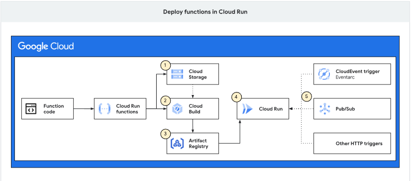
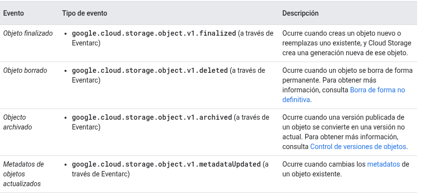
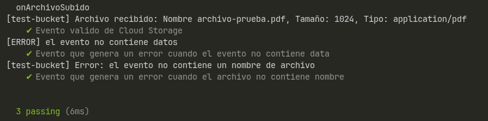
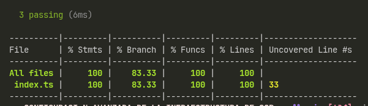

# Desarrollar una Cloud Function que se active automáticamente al subir un archivo al bucket.

Cloud Run es la plataforma serverless de Google Cloud que permite ejecutar aplicaciones, servicios y funciones sin tener que administrar directamente la infraestructura de servidores.

Anteriormente, Google ofrecía Cloud Functions (2nd gen) como la segunda generación de su servicio de funciones. 

Para este proyecto se utilizará una Cloud Run function activada por un evento de Cloud Storage cuando se suba un archivo.

Cuando se implementa el código fuente de la función en Cloud Run Functions, ese código fuente se almacena en un bucket de Cloud Storage. Después Cloud Build compila el código de forma automática en una imagen de contenedor y envía esa imagen a un registro de imágenes de Artifact Registry. Cloud Run Functions accede a esta imagen cuando necesita ejecutar el contenedor para ejecutar la función.



Las funciones basadas en eventos se basan en CloudEvents, una especificación estándar de la industria para describir los datos de eventos de manera común.

El disparador se configura mediante Eventarc, seleccionando Cloud Storage como proveedor y estableciendo los filtros correspondientes:

- Tipo de evento: google.cloud.storage.object.v1.finalized
- Bucket: bucket que se desea monitorear.
- Destino: Cloud Run function desarrollada.

Eventarc filtra los eventos y únicamente envía a la función aquellos que coincidan con los filtros configurados.

## Datos recibidos

Para eventos relacionados con objetos de Cloud Storage, Google define StorageObjectData como el esquema de los datos contenidos en event.data.



En TypeScript se utiliza este tipo para disponer de tipado y autocompletado durante el desarrollo:

```typescript
cloudEvent<StorageObjectData>()
```
## Validación de event.data

Para un evento válido google.cloud.storage.object.v1.finalized, se espera que event.data contenga los datos del objeto de Cloud Storage.

Aun así, la función comprueba que event.data exista antes de procesarlo:

```typescript
const file = event.data;

if (!file) {
    throw new Error(`[ERROR] el evento no contiene datos`);
}
```

Esta comprobación es una decisión de programación defensiva, no una indicación de que Cloud Storage normalmente envíe eventos sin datos. Permite que la función falle de forma controlada ante entradas inválidas o incompletas y facilita la implementación de pruebas unitarias para escenarios de error, además, usando typescript este objeto data puede tener un valor undefined.

## Manejo de errores

```typescript
catch (error) {
    // Cualquier trhow dentro del bloque try terminará aquí
    const msg = error instanceof Error ? error.message : String(error);
    console.error(`${msg}`);


    throw error;
}
```

El catch permite registrar información sobre el problema antes de finalizar la ejecución, permitiendo generar mensajes de error dentro del contexto donde se conocen datos del objeto data, facilitando la depuración.

Después de registrar el error, este se vuelve a lanzar mediante throw error. De esta manera, el error no se consume silenciosamente y la ejecución termina indicando que el procesamiento falló.


## Logging

```typescript
console.log(`[${file.bucket}] Archivo recibido: Nombre ${name}, Tamaño: ${size}, Tipo: ${contentType}`);
```

La función utiliza console.log() para registrar el procesamiento correcto y console.error() para registrar errores.

Los registros permiten identificar el archivo procesado y consultar información relevante para depuración. Cloud Run captura la salida estándar y de error de la aplicación y permite consultar estos registros mediante Cloud Logging.

## Pruebas unitarias

Evento válido de Cloud Storage

Se simula un evento google.cloud.storage.object.v1.finalized que contiene la información de un archivo:

- Bucket
- Nombre
- Tamaño
- Tipo de contenido

La prueba ejecuta onArchivoSubido() con este evento y verifica que la función registre correctamente la información del archivo mediante console.log().

Evento sin datos

Se simula un evento de Cloud Storage que no contiene la propiedad data. La prueba verifica que la función:

- Detecte que el evento no contiene datos.
- Genere una excepción.
- Registre el error mediante console.error().

Este caso permite comprobar el manejo de eventos inválidos o incompletos.

Evento de archivo sin nombre

Simula un evento de Cloud Storage que contiene datos del archivo, pero no incluye su nombre. Se verifica que:

- Detecte esta información faltante
- Registre el error mediante console.error()
- Genere la excepción correspondiente.

Al ejecutar las pruebas el resultado es



Ademas, se puede ejecutar una prueba de coverage utilizando c8 y permite conocer qué partes del código fueron ejecutadas durante las pruebas.

Los resultados obtenidos fueron:

- Statements: 100%: todas las instrucciones fueron ejecutadas.
- Branches: 83.33%: se probaron la mayoría de los posibles caminos de ejecución.
- Functions: 100%: todas las funciones fueron ejecutadas.
- Lines: 100%: todas las líneas ejecutables fueron cubiertas.



